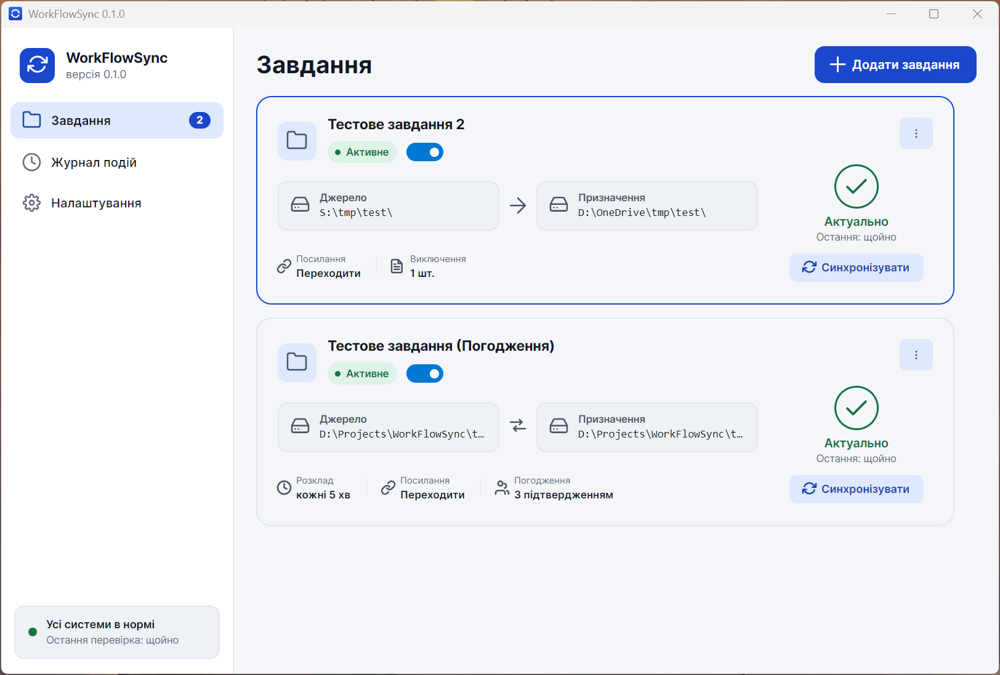
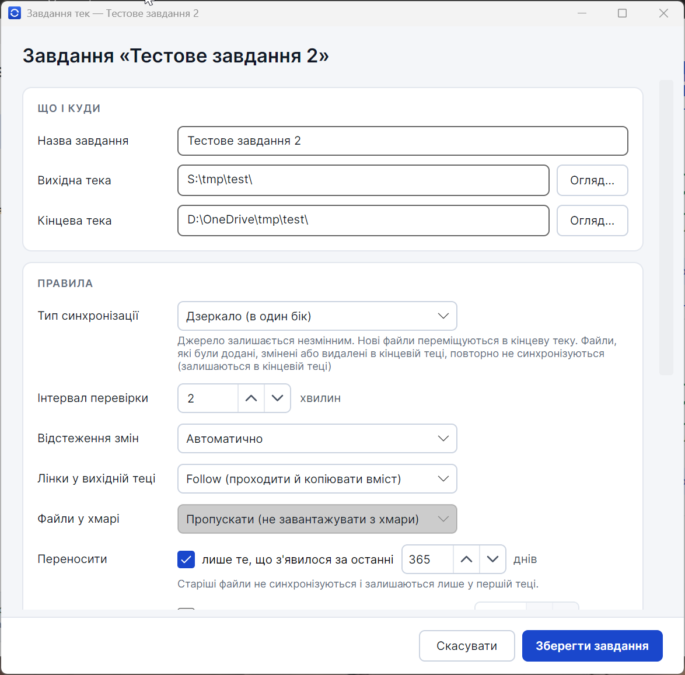
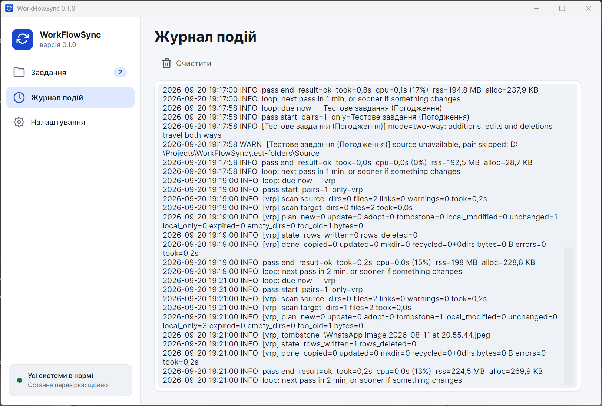
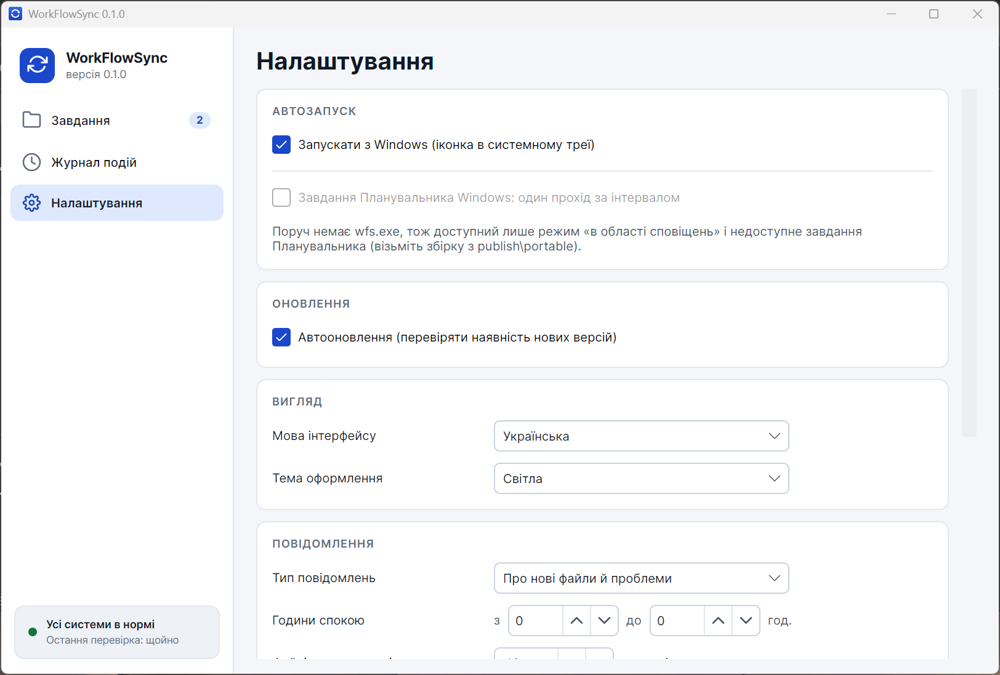
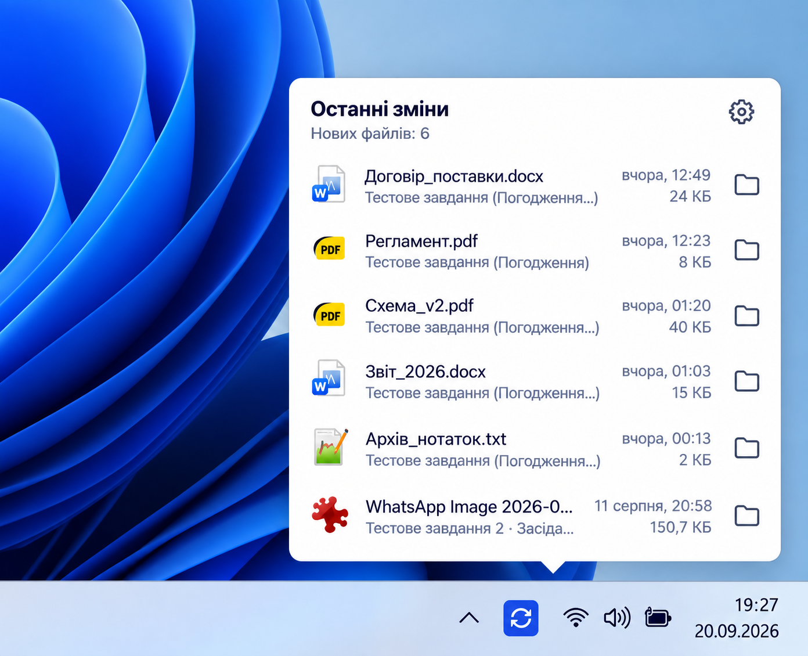

# WorkFlowSync: синхронізація файлів та папок

**WorkFlowSync** - проста, надійна та зручна програма для синхронізації файлів і папок на Windows.

Вона створена для того, щоб ваші робочі документи, проєкти чи архіви завжди були під рукою в актуальному стані. Наприклад, ви можете налаштувати синхронізацію між спільною папкою на сервері компанії та вашою локальною папкою (зокрема в OneDrive). Програма сама слідкує за змінами і виконує всю рутину за вас.

Головна перевага: **програма пам'ятає історію ваших дій**. Більшість звичайних синхронізаторів діють наосліп і можуть ненароком перетерти ваші свіжі правки або знову завантажити файли, які ви давно видалили. WorkFlowSync знає, що ви змінили чи прибрали у себе, тому ваші файли завжди в безпеці, а чужі правки не знищать вашу роботу.

Працює на Windows відразу після розпаковки, без встановлення та без прав адміністратора.

---

## Як виглядає програма

Скріншоти інтерфейсу допоможуть вам одразу оцінити зручність роботи:

### 1. Головне вікно зі списком ваших завдань
Тут зібрані всі ваші пари папок для синхронізації. Ви бачите, що зараз відбувається, коли була остання перевірка і чи всі файли актуальні. Можна швидко запустити або призупинити будь-яке завдання в один клік.



### 2. Просте налаштування кожної папки
Додати нове завдання або змінити налаштування можна буквально за хвилину: вибираєте звідки й куди копіювати, вказуєте зручний розклад та за потреби додаєте правила (наприклад, брати лише свіжі файли за останній рік або виключити тимчасові файли).



### 3. Зрозумілий журнал подій
Ви завжди точно знаєте, що саме робить програма. У журналі відкрито показано кожен прохід: скільки файлів перевірено, що скопійовано, а що пропущено.



### 4. Налаштування під ваші вподобання
Обирайте мову інтерфейсу (українська або англійська), темну чи світлу тему, налаштовуйте тихі години для сповіщень, автоматичний запуск разом із Windows та перевірку оновлень.



### 5. Робота у фоні та швидкий доступ біля годинника
WorkFlowSync тихо живе значком у системному треї Windows і не відволікає від роботи. Клікнувши на іконку біля годинника, ви завжди можете швидко побачити список останніх синхронізованих файлів і відкрити їх в один клік.



---

## Чому це зручно (головні переваги)

- **Файли завжди з вами.** Важлива папка з мережевого диска зберігається у вас на комп'ютері. Ви можете працювати з документами у поїздці, без інтернету або переглядати їх з телефона через OneDrive.
- **Ніяких неприємних несподіванок.** Якщо хтось на сервері видалив файл, у вашій локальній копії він не зникне без вашого відома.
- **Ваші зміни ніхто не затре.** Якщо ви змінили чи видалили файл у своїй папці, програма запам'ятає це і не повертатиме стару версію назад.
- **Не треба засмічувати диск усім архівом.** Можна вказати правило «синхронізувати лише файли, створені за останні 365 днів». Старі архіви залишаться на сервері й не займатимуть ваше місце.
- **Безпечне видалення.** Якщо щось видаляється локально, файл відправляється у звичайний Кошик Windows, звідки його завжди можна повернути.
- **Синхронізація без сміття.** Тимчасові файли, кеш чи чернетки легко внести у список виключень.
- **Автоматична робота.** Після простого налаштування програма сама тихо оновлює файли у фоні.

---

## Два прості способи синхронізації

Для кожної пари папок можна вибрати саме той режим, який підходить для вашої задачі:

1. **Дзеркало (в один бік): зі спільного сервера до вас**
   Ідеально для щоденної роботи зі спільними документами. Усе нове із сервера автоматично з'являється у вас. Програма лише читає спільну папку: вона гарантовано нічого не видалить і не зіпсує на сервері.

2. **Повна синхронізація (в обидва боки): між двома папками**
   Корисно, якщо треба тримати однаковий вміст на двох комп'ютерах (наприклад, на робочому й домашньому). Зміни в одній папці повторюються в іншій. Для важливих файлів є режим **погодження змін**, де ви самі підтверджуєте оновлення.

---

## Як почати користуватися

1. **Завантажте** портативний архів і розпакуйте його в будь-яку зручну папку на диску (наприклад, `D:\Tools\WorkFlowSync`).
2. **Запустіть** `WorkFlowSync.exe`.
3. Натисніть **«+ Додати завдання»**, виберіть потрібні папки, і синхронізація почнеться!

Щоб програма автоматично запускалася під час увімкнення комп'ютера, увімкніть опцію **«Запускати з Windows»** у Налаштуваннях. Вона тихо працюватиме у треї біля годинника.

Всі налаштування та історія зберігаються поруч із програмою, тому її можна легко перенести на інший комп'ютер разом з усіма налаштуваннями.

---

## Для тих, хто любить консоль

У комплекті також є швидка консольна утиліта `wfs.exe` для автоматизації, скриптів або Планувальника завдань Windows:

```powershell
wfs sync --once --dry-run   # тестовий запуск: показати, що зміниться, нічого не чіпаючи
wfs sync --once             # один швидкий прохід синхронізації
wfs sync --loop             # безперервна фонова синхронізація
wfs status                  # стан і результат останньої перевірки
```

---

## Документація

- [Огляд продукту та каталог можливостей](docs/product/README.md)
- [Технічні вимоги](docs/requirements.md) · [Архітектура рішення](docs/architecture.md)
- [Розгортання](docs/deployment.md) · [Тестування](docs/testing.md) · [Діагностика](docs/debugging.md)

---

## Збірка з вихідного коду

Для збірки потрібен .NET SDK 8.0:

```powershell
powershell -NoProfile -ExecutionPolicy Bypass -File scripts\build.ps1
powershell -NoProfile -ExecutionPolicy Bypass -File scripts\test.ps1
powershell -NoProfile -ExecutionPolicy Bypass -File scripts\package.ps1   # готовий zip-архів у publish\
```

---

## Ліцензія

MIT © 2026 Білик Ігор
